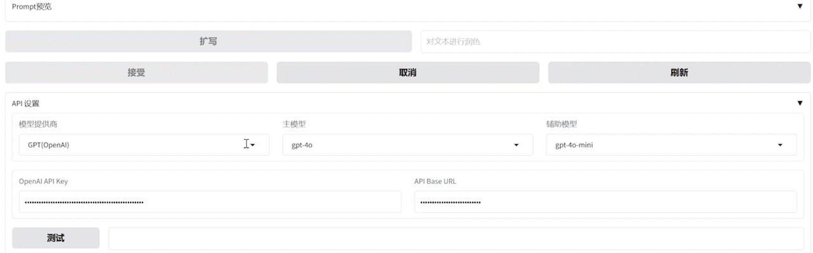
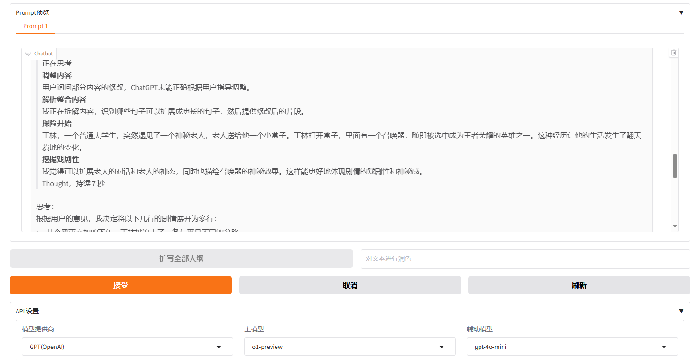
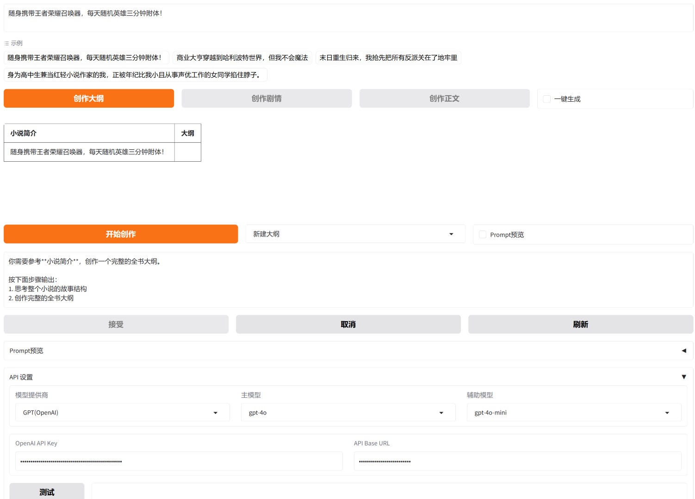

<h1 align="center">Long-Novel-GPT</h1>

<p align="center">
  AI一键生成长篇小说
</p>

<p align="center">
  <a href="#关于项目">关于项目</a> •
  <a href="#更新日志">更新日志</a> •
  <a href="#小说生成prompt">小说生成Prompt</a> •
  <a href="#快速上手">快速上手</a> •
  <a href="#demo使用指南">Demo使用指南</a> •
  <a href="#贡献">贡献</a>
</p>

<hr>

<h2 id="关于项目">🎯 关于项目</h2>

该项目包括一个基于 GPT 等大语言模型的长篇小说生成器，同时还有各类小说生成 Prompt 以及教程。我们欢迎社区贡献，持续更新以提供最佳的小说创作体验。

### 💡 设计思路
Long-Novel-GPT是一个基于GPT等大语言模型的长篇小说生成器。它采用层次化的大纲/章节/正文结构，以把握长篇小说的连贯剧情；通过大纲->章节->正文的精准映射来获取上下文，从而优化API调用成本；并根据自身或用户反馈不断进行优化，直至创作出你心目中的长篇小说。

### 🌟 关键特性

- **结构化写作**：层次化结构有效把握长篇小说的发展脉络
- **反思循环**：持续优化生成的大纲、章节和正文内容
- **成本优化**：智能上下文管理，确保 API 调用费用固定
- **社区驱动**：欢迎贡献 Prompt 和改进建议，共同推动项目发展

<h2 id="更新日志">📅 更新日志</h2>

### 🎉 Long-Novel-GPT 1.10 更新（11月28日最新）
- 在线演示：[Long-Novel-GPT Demo](http://117.72.16.208:7860/)
- 在创作时支持单独对选中的段落进行重新创作（通过引用文本）
- 大纲、章节、正文的生成Prompt得到了优化


### 🎉 Long-Novel-GPT 1.9 更新（11月16日）
- 对于大纲、章节、正文分别内置了三种Prompt可供选择：新建、扩写、润色
- 支持输入自己的Prompt
- Prompt预览的交互逻辑更好了
- 支持一键生成，将自动帮你进行全部大纲、章节、正文的生成
- 新增支持智谱GLM模型


### 🎉 Long-Novel-GPT 1.8 更新（11月1日）
- 新增支持多种大语言模型：
  - OpenAI系列: o1-preivew、o1-mini、gpt4o 等
  - Claude系列: Claude-3.5-Sonnet 等
  - 文心一言: ERNIE-4.0、ERNIE-3.5、ERNIE-Novel
  - 豆包: doubao-lite/pro系列
  - 支持任何兼容OpenAI接口的自定义模型
- 优化了生成界面和用户体验

<p align="center">
  
  <br>
  <em>Demo支持多种大语言模型（<a href="assets/support_models_preview.gif">图中</a>展示的是API设置界面）</em>
</p>

### 🎉 Long-Novel-GPT 1.7 更新（10月29日）

- 提供了一个在线Demo，支持从一句话创意直接生成全书。


### 🔮 后续更新计划
- 考虑一个更美观更实用的编辑界面（已完成）
- 支持文心 Novel 模型（已完成）
- 支持豆包模型（已完成）
- 通过一个创意直接一键生成完整长篇小说（进行中）
- 支持生成大纲和章节（进行中）


### 📜 之前版本
Long-Novel-GPT 1.5及之前版本提供了一个完整的长篇小说生成APP，但是在操作体验上并不完善。从1.6版本起，将更加注重用户体验，重写了一个新的界面，并将项目文件搬到了[core](core)目录下。之前的[demo](demo/app.py)已经不支持了，如果想要体验，可以选择之前的commit进行下载。

<h2 id="小说生成prompt">📚 小说生成 Prompt</h2>

| Prompt | 描述 |
|--------|------|
| [天蚕土豆风格](custom/根据提纲创作正文/天蚕土豆风格.txt) | 用于根据提纲创作正文，模仿天蚕土豆的写作风格 |
| [对草稿进行润色](custom/根据提纲创作正文/对草稿进行润色.txt) | 对你写的网文初稿进行润色和改进 |

[📝 提交你的 Prompt](https://github.com/MaoXiaoYuZ/Long-Novel-GPT/issues/new?assignees=&labels=prompt&template=custom_prompt.md&title=新的Prompt)

<h2 id="快速上手">🚀 快速上手</h2>

### 在线 Demo

无需安装，立即体验我们的在线 Demo：[Long-Novel-GPT Demo](http://117.72.16.208:7860/)

<p align="center">
  
  <br>
  <em>多线程并行创作（<a href="assets/write_text_preview.gif">图中</a>展示的是创作正文的场景）</em>
</p>

<p align="center">
  
  <br>
  <em>支持查看Prompt(<a href="assets/o1-preview-prompt-preview.png">图中</a>是o1-preview模型的回答）</em>
</p>

### 本地安装

如果您希望在本地运行 Long-Novel-GPT：

```bash
conda create -n lngpt python
conda activate lngpt
pip install -r requirements.txt
```

### 启动界面

```bash
cd Long-Novel-GPT
python core/frontend.py
```

启动后在浏览器中访问链接即可：[http://localhost:7860/](http://localhost:7860/)

<p align="center">
  
</p>

<h2 id="demo使用指南">🖥️ Demo 使用指南</h2>

### 当前Demo能生成百万字小说吗？
可以，Long-Novel-GPT-1.9通过多线程生成，自动管理上下文，确保了生成剧情的连续。
在1.7版本中，你需要部署在本地并采用自己的API-Key，在 [`config.py`](config.py) 中配置生成时采用的最大线程数。
```python
MAX_THREAD_NUM = 5 # 生成时采用的最大线程数
```
在线Demo是不行的，因为最大线程为5。

### 如何利用LN-GPT-1.9生成百万字小说？
首先，你需要部署在本地，配置API-Key并解除线程限制。

然后，在**创作大纲**阶段，需要生成大概40行的剧情，每行50字，这里就有2000字了。（通过不断点击**扩写全部大纲**）

其次，在**创作剧情**阶段，将大纲2k字扩充到20k字。（10+线程并行）

最后，在**创作正文**阶段，将20K字扩充到100k字。（50+线程并行）


### LN-GPT-1.9生成的百万字小说怎么样？
1.7版本是首个支持生成百万级别小说的版本，其主要保证的是多线程的处理，生成窗口的管理并且提供一个完整的界面。

1.9版本在Prompt上有了极大了优化，提供了新建、扩写、润色三种Prompt供用户选择，而且还支持输入Prompt。

总的来说，1.9版本能够实现在用户监督下生成达到签约门槛的网文。

我们的最终目标始终是实现一键生成全书，将在2-3个版本迭代后正式推出。


### 在线Demo使用指南
1. 当前Demo支持GPT、Claude、文心、豆包、GLM等模型，并且已经配置了API-Key，默认模型为GPT4o，最大线程数为5。
2. 可以选中**示例**中的任意一个创意，然后点击**创作大纲**来初始化大纲。
3. 初始化后，点击**开始创作**按钮，可以不断创作大纲，直到满意为止。
4. 创建完大纲后，点击**创作剧情**按钮，之后重复以上流程。
5. 选中**一键生成**后，再次点击左侧按钮可以一键生成。
6. 如果遇到任何无法解决的问题，请点击**刷新**按钮。
7. 如果问题还是无法解决，请刷新浏览器页面，这会导致丢失所有数据，请手动备份重要文本。

<h2 id="贡献">🤝 贡献</h2>

我们欢迎所有形式的贡献，无论是新功能的建议、代码改进，还是 bug 报告。请通过 GitHub issues 或 pull requests 与我们联系。

大家也可以加入群，在群里讨论。

<p align="center">
  
</p>
