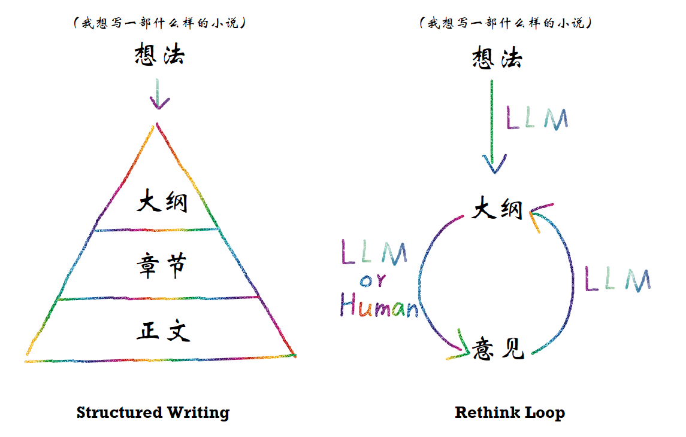
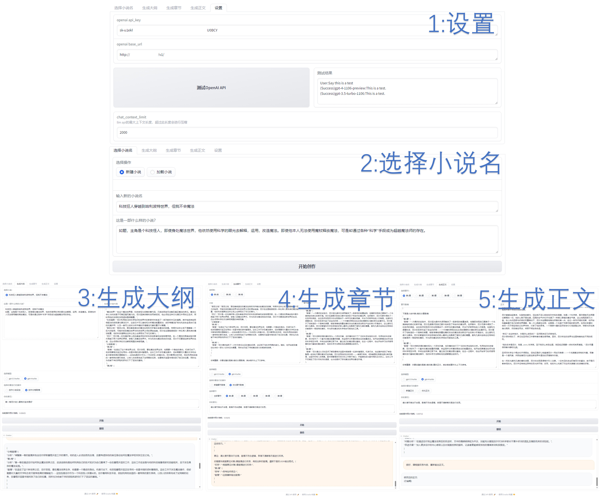

# Long-Novel-GPT

## 关于项目
Long-Novel-GPT是一个基于GPT等大语言模型的长篇小说生成器。它采用层次化的大纲/章节/正文结构，以把握长篇小说的连贯剧情，通过上下文管理优化API调用成本，并根据自身或用户反馈不断进行优化，直至达到预定目标。

## 目标
本项目的目标是根据用户提供的初步想法（例如：我想写一部xxx样的小说），通过AI不断完善和构建小说内容，最终生成达到人类作家水平的长篇小说。

## 更新日志
- 2024.1.20：<生成章节>页面支持润色，可以单独对字段进行修改。
- 2024.2.24：支持直接使用ChatGPT网页作为API，将调用成本减为0。
- 2024.3.10（版本1.3）：支持单独生成大纲/章节/正文。
- **2024.4.1（版本1.4）：prompt有更好的表现，更低的调用费用；支持手动修改；**（**最新更新**）


### V 1.4
***
（1.4版本更新不兼容之前存档文件，老用户需要根据requirements安装特定版本promptflow）
1. 支持在页面中直接手动修改大纲/章节/正文
2. 采用PromptFlow重构prompt。
3. 所有prompt更新，采用md输出格式替代JSON，更便于读取和修改。
4. 重写逻辑优化，现在可以只针对选定的文本进行重写。


## 后续更新计划
- 支持单独生成大纲/章节/正文的功能（已完成）
- 在重写时可以只针对选定文本（已完成）
- 支持自定义prompt（进行中）
- 由AI给出意见，而不是人工反馈（未开始）

## 关键特性
- **结构化写作**：通过层次化的大纲/章节/正文来进行结构化写作，有效把握长篇小说的发展脉络。
- **反思循环**：在不断的反思中优化生成的大纲、章节和正文内容。
- **成本优化**：通过上下文管理优化API调用成本，确保每次API调用的费用固定，不会因反思次数增加而上升。




## 快速上手

### 安装
```bash
conda create -n lngpt python
conda activate lngpt
pip install -r requirements.txt
```

### 界面
我们提供了一个Gradio Demo用于展示Long-Novel-GPT的功能。可以通过以下命令启动：
```bash
cd Long-Novel-GPT
python demo/app.py
```

Gradio DEMO中有5个Tab页面，分别为：
- **生成小说名**：这是初始页面，用于新建或加载小说项目。你生成的所有内容会被保存在`Long-Novel-GPT/output/{小说名}`下。
- **生成大纲**：在选择小说后，可以在这里生成小说的大纲。
- **生成章节**：在此处生成小说的各个章节。
- **生成正文**：在此编写小说的具体内容。
- **设置**：在这里设置OpenAI API以及一些生成小说的参数。



## 如何使用ChatGPT作为API(1.4版本暂不支持)

本指南将帮助您使用ChatGPT作为API。请遵循以下步骤：

### 1.安装AutoChatScript

首先，您需要安装AutoChatScript。请访问[AutoChatScript GitHub 仓库](https://github.com/MaoXiaoYuZ/AutoChatScript)并按照安装说明进行操作。

### 2. 启动服务

安装完毕后，通过以下命令启动服务：

```bash
cd AutoChatScript
python openai_api.py --server-port 8000
```

这将在本地启动服务，并监听8000端口。

### 3. 配置Demo

在AutoChatScript的demo <设置> 页面中，填写ChatGPT的`base_url`为：

```
http://localhost:8000/v1/
```

确保`8000`端口与步骤2中的服务器端口一致。输入后，请点击测试按钮以确保配置正确。

### 4. 效果展示


## 使用指南
1. GPT-3.5可能不足以生成达到签约或出版水平的小说，请优先选择GPT-4或文心4 API。
2. 请在**设置**页面中配置OpenAI或文心API，否则无法使用。
3. 在生成小说名后可以自行选择生成大纲，章节或正文。
4. 如果遇到任何无法解决的问题，请尝试刷新页面或重启程序。


## 贡献
我们欢迎所有形式的贡献，无论是新功能的建议、代码改进，还是bug报告。请通过GitHub issues或pull requests与我们联系。