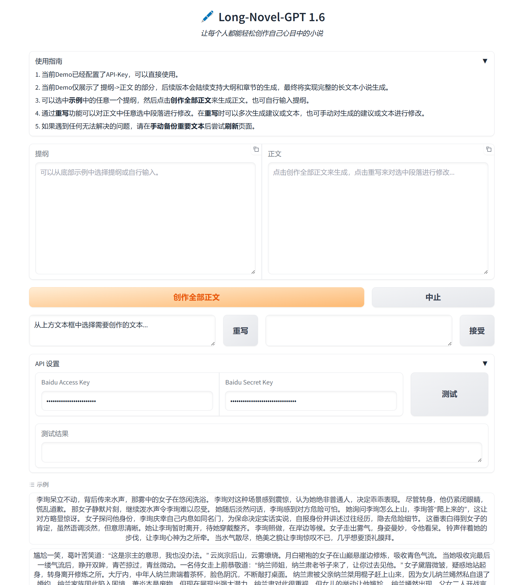

<h1 align="center">Long-Novel-GPT</h1>

<p align="center">
  让每个人都能轻松创作自己心目中的长篇小说
</p>

<p align="center">
  <a href="#关于项目">关于项目</a> •
  <a href="#更新日志">更新日志</a> •
  <a href="#小说生成prompt">小说生成Prompt</a> •
  <a href="#快速上手">快速上手</a> •
  <a href="#demo使用指南">Demo使用指南</a> •
  <a href="#贡献">贡献</a>
</p>

<hr>

<h2 id="关于项目">🎯 关于项目</h2>

该项目包括一个基于 GPT 等大语言模型的长篇小说生成器，同时还有各类小说生成 Prompt 以及教程。我们欢迎社区贡献，持续更新以提供最佳的小说创作体验。

### 💡 设计思路
Long-Novel-GPT是一个基于GPT等大语言模型的长篇小说生成器。它采用层次化的大纲/章节/正文结构，以把握长篇小说的连贯剧情；通过大纲->章节->正文的精准映射来获取上下文，从而优化API调用成本；并根据自身或用户反馈不断进行优化，直至创作出你心目中的长篇小说。

### 🌟 关键特性

- **结构化写作**：层次化结构有效把握长篇小说的发展脉络
- **反思循环**：持续优化生成的大纲、章节和正文内容
- **成本优化**：智能上下文管理，确保 API 调用费用固定
- **社区驱动**：欢迎贡献 Prompt 和改进建议，共同推动项目发展

<h2 id="更新日志">📅 更新日志</h2>

### 🎉 Long-Novel-GPT 1.6 重大更新

- 提供了 提纲（草稿）-> 正文的 Demo
- 在线演示：[Long-Novel-GPT Demo](http://49.234.185.218:7860/)

### 🔮 后续更新计划
- 支持文心 Novel 模型（进行中）
- 支持豆包模型（进行中）
- 支持生成大纲和章节（进行中）
- 考虑一个更美观更实用的编辑界面（未开始）
- 通过一个创意直接一键生成完整长篇小说（未开始）

### 📜 之前版本
Long-Novel-GPT 1.5及之前版本提供了一个完整的长篇小说生成APP，但是在操作体验上并不完善。从1.6版本起，将更加注重用户体验，重写了一个新的界面，并将项目文件搬到了[core](core/frontend.py)目录下。之前的[demo](demo/app.py)已经不支持了，如果想要体验，可以选择之前的commit进行下载。

<h2 id="小说生成prompt">📚 小说生成 Prompt</h2>

| Prompt | 描述 |
|--------|------|
| [天蚕土豆风格](custom/根据提纲创作正文/天蚕土豆风格.txt) | 用于根据提纲创作正文，模仿天蚕土豆的写作风格 |
| [对草稿进行润色](custom/根据提纲创作正文/对草稿进行润色.txt) | 对你写的网文初稿进行润色和改进 |

[📝 提交你的 Prompt](https://github.com/MaoXiaoYuZ/Long-Novel-GPT/issues/new?assignees=&labels=prompt&template=custom_prompt.md&title=新的Prompt)

<h2 id="快速上手">🚀 快速上手</h2>

### 在线 Demo

无需安装，立即体验我们的在线 Demo：[Long-Novel-GPT Demo](http://49.234.185.218:7860/)


### 本地安装

如果您希望在本地运行 Long-Novel-GPT：

```bash
conda create -n lngpt python
conda activate lngpt
pip install -r requirements.txt
```

### 启动界面

```bash
cd Long-Novel-GPT
python core/frontend.py
```

<p align="center">
  
</p>

<h2 id="demo使用指南">🖥️ Demo 使用指南</h2>

1. 当前 Demo 仅展示了 提纲->正文 的部分，后续版本会陆续支持大纲和章节的生成。
2. 选中**示例**中的任意一个提纲，点击**创作全部正文**来生成正文。也可自行输入提纲。
3. 通过**重写**功能可以对正文中任意选中段落进行修改。
4. 如遇问题，请在**手动备份重要文本**后尝试**刷新**页面。

<h2 id="贡献">🤝 贡献</h2>

我们欢迎所有形式的贡献，无论是新功能的建议、代码改进，还是 bug 报告。请通过 GitHub issues 或 pull requests 与我们联系。

---