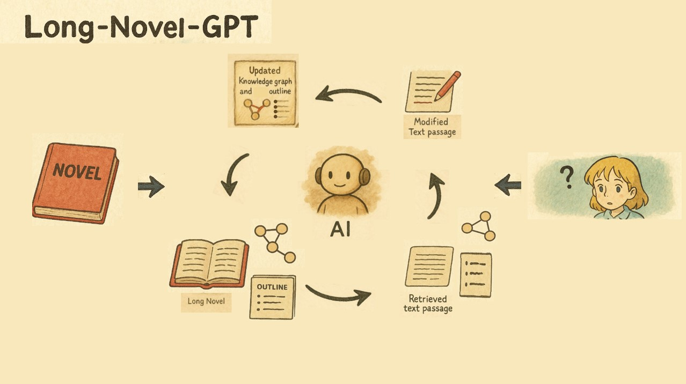

<h1 align="center">Long-Novel-GPT</h1>

<p align="center">
  AI一键生成长篇小说
</p>

<p align="center">
  <a href="#关于项目">关于项目</a> •
  <a href="#更新日志">更新日志</a> •
  <a href="#小说生成prompt">小说生成Prompt</a> •
  <a href="#快速上手">快速上手</a> •
  <a href="#demo使用指南">Demo使用指南</a>
</p>

<hr>

<h2 id="关于项目">🎯 关于项目</h2>

Long-Novel-GPT的核心是一个基于LLM和RAG的长篇小说Agent，根据用户的提问（要写什么小说，要对什么情节做出什么改动）LNGPT会调用工具检索相关正文片段和剧情纲要，并且对相关正文片段进行修改，同时更新剧情纲要。流程如下：

<p align="center">
  
</p>

1. 从本地导入现有小说
2. 拆书（提取剧情人物关系，生成剧情纲要）
3. 输入你的意见
4. 检索相关正文片段和剧情纲要
5. 对正文片段进行修改
6. 同步更新剧情纲要


<h2 id="更新日志">📅 更新日志</h2>

### 🎉 Long-Novel-GPT 2.2 更新
- 支持查看Prompt
- **支持导入小说，在已有的小说基础上进行改写**
- 支持在**设置**中选择模型
- 支持在创作时实时**显示调用费用**

<p align="center">
  
</p>

### 🎉 Long-Novel-GPT 2.1 更新
- 支持选择和创作章节

### 🎉 Long-Novel-GPT 2.0 更新
- 提供全新的UI界面


### 🔮 后续更新计划
- 考虑一个更美观更实用的编辑界面（已完成）
- 支持文心 Novel 模型（已完成）
- 支持豆包模型（已完成）
- 通过一个创意直接一键生成完整长篇小说（进行中）
- 支持生成大纲和章节（进行中）


<h2 id="小说生成prompt">📚 小说生成 Prompt</h2>

| Prompt | 描述 |
|--------|------|
| [天蚕土豆风格](custom/根据提纲创作正文/天蚕土豆风格.txt) | 用于根据提纲创作正文，模仿天蚕土豆的写作风格 |
| [对草稿进行润色](custom/根据提纲创作正文/对草稿进行润色.txt) | 对你写的网文初稿进行润色和改进 |

[📝 提交你的 Prompt](https://github.com/MaoXiaoYuZ/Long-Novel-GPT/issues/new?assignees=&labels=prompt&template=custom_prompt.md&title=新的Prompt)

<h2 id="快速上手">🚀 快速上手</h2>

### Docker一键部署

运行下面命令拉取long-novel-gpt镜像
```bash
docker pull maoxiaoyuz/long-novel-gpt:latest
```

下载或复制[.env.example](.env.example)文件，将其放在你的任意一个目录下，将其改名为 **.env**, 并根据文件中提示填写API设置。

填写完成后在该 **.env**文件目录下，运行以下命令：
```bash
docker run -p 80:80 --env-file .env -d maoxiaoyuz/long-novel-gpt:latest
```
**注意，如果你在启动后改动了.env文件，那么必须关闭已启动的容器后，再运行上述命令才行。**

接下来访问 http://localhost 即可使用，如果是部署在服务器上，则访问你的服务器公网地址即可。


<p align="center">
  
</p>

### 使用本地的大模型服务
要使用本地的大模型服务，只需要在Docker部署时额外注意以下两点。

第一，启动Docker的命令需要添加额外参数，具体如下：
```bash
docker run -p 80:80 --env-file .env -d --add-host=host.docker.internal:host-gateway maoxiaoyuz/long-novel-gpt:latest
```

第二，将本地的大模型服务暴露为OpenAI格式接口，在[.env.example](.env.example)文件中进行配置，同时GPT_BASE_URL中localhost或127.0.0.1需要替换为：**host.docker.internal**
例如
```
# 这里GPT_BASE_URL格式只提供参考，主要是替换localhost或127.0.0.1
# 可用的模型名可以填1个或多个，用英文逗号分隔
LOCAL_BASE_URL=http://host.docker.internal:7777/v1
LOCAL_API_KEY=you_api_key
LOCAL_AVAILABLE_MODELS=model_name1,model_name2
# 只有一个模型就只写一个模型名，多个模型要用英文逗号分割
```

<h2 id="demo使用指南">🖥️ Demo 使用指南</h2>

### 当前Demo能生成百万字小说吗？
Long-Novel-GPT-2.1版本完全支持生成百万级别小说的版本，而且是多窗口同步生成，速度非常快。

同时你可以自由控制你需要生成的部分，对选中部分重新生成等等。

而且，Long-Novel-GPT-2.1会自动管理上下文，在控制API调用费用的同时确保了生成剧情的连续。

在2.1版本中，你需要部署在本地并采用自己的API-Key，在[.env.example](.env.example)文件中配置生成时采用的最大线程数。
```
# Thread Configuration - 线程配置
# 生成时采用的最大线程数
MAX_THREAD_NUM=5
```
在线Demo是不行的，因为最大线程为5。

### 如何利用LN-GPT-2.1生成百万字小说？
首先，你需要部署在本地，配置API-Key并解除线程限制。

然后，在**创作章节**阶段，创作50章，每章200字。（50+线程并行）

其次，在**创作剧情**阶段，将每章的200字扩充到1k字。

最后，在**创作正文**阶段，将每章的1K字扩充到2k字，这一步主要是润色文本和描写。

一共，50 * 2k = 100k (十万字)。

**创作章节支持创作无限长度的章节数，同理，剧情和正文均不限长度，LNGPT会自动进行切分，自动加入上下文，并自动采取多个线程同时创作。**

### LN-GPT-2.1生成的百万字小说怎么样？
总的来说，2.1版本能够实现在用户监督下生成达到签约门槛的网文。

而且，我们的最终目标始终是实现一键生成全书，将在2-3个版本迭代后正式推出。
